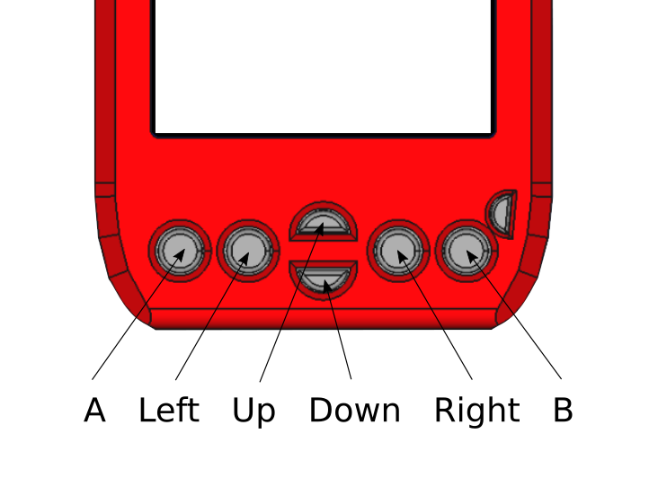

  Automatically generated documentation of SDA OS system functions

 - [OS Gui](sda_os_gui.md)
 - [Sound](sda_os_sound.md)
 - [Callendar widget](sda_os_widgets.md)
 - [Text obfuscation](sda_os_crypto.md)

#### SVP API Level history

API level given by *sys.os.getVer* etc. works like this: 
1000 - SDA version 1.0.0 with all its features
 ...
1120 - SDA version 1.1.2 with all its features

#### Constants
| Constant | Description |
|   ---    |    ---      |
| SVP_LANG_CZ | Czech language |
| SVP_LANG_ENG | English language |

#### Main OS functions
##### Get redraw flag
    sys.os.getRedraw();
Gets redraw flag. *getRedraw* also works.
Return: [num] 1 if redraw flag is set, otherwise 0
##### Set redraw
    sys.os.setRedraw();
Sets redraw flag
Return: None
##### Wake the SDA from sleep
    sys.os.wake();
Wakes SDA without turning the screen on.
SDA will wake in the low power mode and will sleep again after the lcd shutdown time.
Return: None
##### Pushes app to foreground
    sys.os.arise();
If called from timer callback, the app is promoted to the foreground.
Return: None
##### Get if running in simulator
    sys.os.inSim();
Gets if app is running in simulator. 1 - Simulator, 0 - Real hardware.
Return: [num] result
##### Show Error
    sys.os.error([str]errorText);
Throws error message
Return: None
##### Gets app path
    sys.os.getAppPath();
Gets diretory path of the currently running svs app
includung the name of the app. 
Return: [str] Path
#### Keyboard
##### Hide keyboard
    sys.os.hideKbd();
Hides system keyboard.
Return: None
##### Show keyboard
    sys.os.showKbd();
Shows system keyboard
Return: None
##### Get Keyboard state
    sys.os.kbdGetState();
Gets if keyboard is deployed 1 - keyboard shown, 0 - keyboard hidden
Return: [num] state

#### Misc

##### Get random number
    sys.os.rnd();
Returns random number
Return: [num]RandomValue
##### Quit program
    sys.os.exit();
    sys.os.exit([undef] arg0, [undef] arg1, [undef] arg2); # optional return values
Stops program execution after exiting *update* function and performing *exit* function.
Return: None
##### Check API level
    sys.os.checkVer([num] API_Level);
Checks for API Lvl support.
If host level is below given API_Level, error is thrown and app is terminated.
Return: None
##### Get API level
    sys.os.getVer();
Checks for API Lvl support.
Return: [num] SDA_OS version number
##### Get system language
    sys.os.getLang();
Returns SDA_OS language.
Return: 0 if czech, 1 if english, also defines SVP_LANG_CZ SVP_LANG_ENG
#### Subprocess
##### Set process as singular
    sys.os.setSingular();
Sets current process as singular.
Return: None
##### Launch subprocess
    sys.os.subProcess([str]fileName, [str/ref] callback, [undef] arg0, [undef] arg1, [undef] arg2);
Runs child process
Return: None
##### Enable launching subprocess from cwd
    sys.os.subProcCWD([num] val);
Sets if subprocesses are launched from cwd or from APPS folder.
val: 0 - APPS folder, 1 - cwd
Return: None
##### Disable caching
    sys.os.subProcNC();
Disables caching for next call of sys.os.subProcess.
Usefull when running modified content
Return: None
##### Return data to parent process
    sys.os.subRetval([undef] arg0, [undef] arg1, [undef] arg2);
Sets values that will be returned to parent process
Return: None
##### Sets the clipboard string
    sys.os.setClipboard([str] string);
Sets the OS clipboard 256 chars by default
Return: [num] 1 - ok, 0 - string too long
##### Gets the clipboard string
    sys.os.getClipboard();
Gets the OS clipboard 256 chars max by default
Return: [str] clipboard_string
#### OS settings functions
##### Reload homescreen settings
    sys.os.settings.homeRld();
Reloads homescreen settings stored in homescreen.cfg
Return: none
##### Requests high privileges
    sys.os.settings.rqAuth();
Requests authorization form user to change system settings.
Result can be retrieved with 'sys.os.settings.getAuth();'
Return: None
##### Gets if privileges are granted
    sys.os.settings.getAuth();
Gets if high privileges are granted.
Return: [num] 1 if authorization is given
##### Sets time and date
    sys.os.settings.setTime([num] year, [num] month, [num] day, [num] hour, [num] min);
Sets values that will be returned to parent process
Return: None
#### Gui
##### Set main application screen
    sys.os.gui.setMainScr([num]id);
Sets main screen to screen with given id
When you wish to display overlay only, set this to 0.
Return: None
##### Get main application screen
    sys.os.gui.getMainScr();
Gets main screen id
Return: [num]id
##### Set root for redraw
    sys.os.gui.setRoot([num]in_apps, [str]dir);
Sets custom root directory for the redraw function.
Return: None
##### Handle keypad input of a screen
    sys.os.gui.btnCtrl([num]screen_id, [num]back_btn_id);
Allows control of a given screen via buttons.
Element given as back_btn_id will be linked with back button,
otherwise back button will bring the user on the SDA_OS main screen.
Return: None
#### Text field handling
##### Handle text input
    sys.os.gui.handleText([num]id, [str]text);
Handles text input fields. Id is field id. Text is default text value.
Return: [str] New modified text value
##### Set keyboard string
    sys.os.gui.setKbdStr([str] string);
Sets the current keyboard string (max 63 chars)
Backspace code is "\b", delete is "\bd"
Return: [num] 1 - ok, 0 - string too long
##### Paste clipboard
    sys.os.gui.pasteClipboard();
Pastes clipboard into active text field
Return: none
##### Get text cursor position
    sys.os.gui.getCPos([num] id);
Gets the cursor position of a text field
Return: [num]id
##### Set text cursor position
    sys.os.gui.setCPos([num] id, [num]val);
Sets the cursor position of a text field
Return: [num]id
##### Switch between landscape and portrait mode
    sys.os.gui.setLandscape([num]val);
Sets the orientation of the display.
1 - Landscape
0 - Portrait
Return: none
##### Get display orientation
    sys.os.gui.getLandscape();
Gets the orientation of the display.
1 - Landscape
0 - Portrait
Return: [num]val 
#### Sound
##### Beep the speaker
    sys.snd.beep();
Initiates system beep.
Return: None
##### Beep the speaker with callback
    sys.snd.beepC([num] frequency_hz, [num] duration_ms, [str] callback);
Makes sound of given frequency and duration, calls given callback afterwards.
Internally calls sys.snd.beepTime and sys.snd.beepFreq, so calling sys.snd.beep();
will produce tone with frequency nad duration of last sys.snd.beepC call.
Return: None
##### Set beep param to default
    sys.snd.beepDef();
Sets beep to its default values.
Return: None
##### Set the duration
    sys.snd.beepTime([num]time (~ms));
Sets lenght of beep.
Return: None
##### Set the frequency
    sys.snd.beepFreq([num]frequency (Hz));
Sets frequency of the beep in Hz in range from 27 to 20000.
Return: None
##### Get if system sound is disabled
    sys.snd.getMute();
Returns system mute
Return: [num]1 if system is on mute.

#### Date selector widget

##### Init calendar widget
    sys.w.cal.init([num]year, [num]month, [num]day) #return: cal screen ID
Creates callendar widget screen.
With given year, month and day.
Return: [num]Callendar widget screen id.
##### Select date
    sys.w.cal.select([num]year, [num]month, [num]day);
Sets year, month and day to callendar widget.
Return: None
##### Update
    sys.w.cal.update();
Updates callendar widget.
Return: [num]1 when callendar is clicked.
##### Mark day
    sys.w.cal.mark([num]day);
Marks day in callendar widget.
Return: None
##### Set highlighting
    sys.w.cal.highlight([num]val);
Enable that all buttons except marked are rendered as ghost buttons.
Return: None
##### Get selected day
    sys.w.cal.getDay();
Returns selected day.
Return: [num]day
#### Counters
##### Set counter
    sys.cnt.set([num] ms);
Sets system timer, it counts down and stops at zero.
Return: None
##### Gets counter
    sys.cnt.get();
Gets system timer value
Return: value of system timer
#### Text obfuscation
##### Unlock overlay init
    sys.cr.unLockInit();
Creates unlock overlay
Return: [num] overlay ID, 0 when error
##### Unlock overlay update
    sys.cr.update([num] ovId);
Updates unlock overlay
Return: None
##### Unlock overlay get ok
    sys.cr.getOk([num] ovId);
Gets if unlock was successfull
Return: [num] 1 - unlock success, 2 - unlock canceled
##### Unlock overlay clear ok
    sys.cr.clrOk([num] ovId);
Creates unlock overlay
Return: None
##### Get if is locked
    sys.cr.getLock();
Gets if crypto is unlocked
Return: [num] 1 - crypto unlocked, 0 - crypto locked
##### Loads password as a key
    sys.cr.loadPass();
Loads OS password as a key
Return: 0 if success, 1 if error
##### Load custom key string
    sys.cr.loadStr([str]key);
Loads custom string as a crypto key
Return: 0 if success, 1 if error
##### Load custom keyfile
    sys.cr.loadKey([str]keyfile);
Loads custom keyfile as a crypto key
Return: 0 if success, 1 if error
##### Load OS keyfile
    sys.cr.loadOSKey();
Loads OS keyfile as a crypto key
Return: 0 if success, 1 if error
##### Generate keyfile
    sys.cr.genKey([str]keyfile);
Generates custom keyfile.
Return: 0 if success, 1 if error
##### Lock
    sys.cr.lock();
Locks sda encryption
Return: None
##### Encrypt file
    sys.cr.encrypt([str]fname);
Encrypts file.
Return: 0 if success, 1 if error
##### Decrypt file
    sys.cr.decrypt([str]fname);
Encrypts file.
Return: 0 if success, 1 if error
##### Encrypt string
    sys.cr.encryptStr([str]source);
Encrypts given string.
Return: [str] encryptedString
##### Decrypt string
    sys.cr.decryptStr([str]source);
Decrypts given string.
Return: [str] decryptedString
### SDA OS HW functions
#### Constants
##### Indicator LED
| Constant | Description |
|   ---    |    ---      |
| LED_ON | Nonification led on |
| LED_OFF | Nonification led off |
| LED_BLINK | Nonification led pattern |
| LED_SHORTBLINK | Nonification led pattern |
| LED_ALARM | Nonification led pattern |
##### Buttons
| Constant | Description |
|   ---    |    ---      |
| BTN_A | Button define |
| BTN_LEFT | Button define |
| BTN_UP | Button define |
| BTN_DOWN | Button define |
| BTN_RIGHT | Button define |
| BTN_B | Button define |
 
##### Expansion pin states
| Constant | Description |
|   ---    |    ---      |
| PIN_IN | Expansion pin setup define |
| PIN_OUT | Expansion pin setup define |
| PIN_ALT | Expansion pin setup define |
| PIN_NOPULL | Expansion pin setup define |
| PIN_PULLUP | Expansion pin setup define |
| PIN_PULLDOWN | Expansion pin setup define |

#### LCD Functions
##### Lock LCD sleep
    sys.hw.lockSleep([num]val);
Sets sleep lock value. On 1 system wont go to sleep.
Return: None
##### Turn on the LCD
    sys.hw.wakeLcd();
Turns on the LCD screen.
Return: None
##### Get LCD state
    sys.hw.getLcdState();
Gets state of lcd.
Return: 1 if lcd is on, otherwise 0
##### Get USB State
    sys.hw.getUsbState();
Gets state of usb port. Useful for determining if the SDA is connected to PC.
Return: 1 when powered from usb, otherwise 0
##### Set notification led pattern
    sys.hw.setLed([num]led_type);
Sets notification led to a given pattern, uses:
LED_ON, LED_OFF ,LED_BLINK, LED_SHORTBLINK, LED_ALARM
Return: None
#### Expansion Ports
##### Define direction of pins on the internal expansion
    sys.iPinDef([num]Pin, [num]type, [num]pullUp);
Sets direction of internal expansion pins.
Uses defines: PIN_IN, PIN_OUT, PIN_ALT, PIN_NOPULL, PIN_PULLUP, PIN_PULDOWN
Pin number is number of pin on the connector, can be read from schematics.
Return: None
##### Set state of pins on the internal expansion
    sys.iPinSet([num]Pin, [num]val);
Sets state of internal expansion pin.
Value 1 sets the pin high, value 0 sets it low.
Pin number is number of pin on the connector, can be read from schematics.
Return: None
##### Get state of pins on the internal expansion
    sys.iPinGet([num]Pin, [num]val);
Gets state of internal expansion pin.
Pin number is number of pin on the connector, can be read from schematics.
Return: 1 if the pin is high, 0 if it is low.
##### Define direction of pins on the expansion
    sys.ePinDef([num]Pin, [num]type, [num]pullUp);
Sets direction of external expansion pins.
Uses defines: PIN_IN, PIN_OUT, PIN_ALT, PIN_NOPULL, PIN_PULLUP, PIN_PULDOWN
Pin number is number of pin on the connector, can be read from schematics.
Return: None
##### Set state of pins on the expansion
    sys.ePinSet([num]Pin, [num]val);
Sets state of external expansion pin.
Value 1 sets the pin high, value 0 sets it low.
Pin number is number of pin on the connector, can be read from schematics.
Return: None
##### Get state of pins on the expansion
    sys.ePinGet([num]Pin, [num]val);
Gets state of external expansion pin.
Pin number is number of pin on the connector, can be read from schematics.
Return: 1 if the pin is high, 0 if it is low.
##### Get ADC readout
    sys.eADCRead();
Gets state of external expansion pin.
Pin number is number of pin on the connector, can be read from schematics.
Return: [float] measured voltage in volts.
#### Buttons
##### Get button event
    sys.hw.btn.getEvent([num] btn)
Return last button event
Return: 0 - none, 1-pressed, 2 - hold, 3 - released
##### Clears button events
    sys.hw.btn.clrEvent([num]btn)
Sets button event to EV_NONE
Return: None
##### Enable button events with LCD off
    sys.hw.btn.stdbyEn([num]val)
Enables button readout with LCD off
Return: None
### Communication
#### Serial transmit queue
Could be used for all the transmission modes.
##### Serial expansion transmit queue
    sys.com.qAdd([num]data);
Queues given hex value to transmit buffer.
Max 32 bytes.
Return: [num] 1-ok, 0-full buffer
##### Serial expansion transmit queue clear
    sys.com.qClr();
Clears transmit buffer.
Return: None
#### USB serial interface

##### USB serial transmit
    sys.com.usbTrs([str]data);
Sends given string to usb serial port.
Return: None
##### USB serial transmit queue
    sys.com.usbTrsQ();
Sends previously stored queue to the initialized serial port.
Queue can be filled with sys.srlTrsQAdd and cleared with sys.srlTrsQClr.
Max 32 bytes.
Return: None
##### USB serial set speed
    sys.com.usbSetBd([num] bd);
Sets baud rate of the usb-serial port
Return: none
##### USB serial receive
    sys.com.usbRcv([num]timeout);
Gets string (max 512 bytes) from USB serial port.
If nothing is sent during timeout (in ms), empty string is returned.
Return: [str] data
##### USB serial receive init
    sys.com.usbRcvIT();
Initializes usb serial port receive operation in non-blocking mode
Returns 1 if ok, 0 if error occurred
Return: [num] result
##### USB serial get ready flag
    sys.com.usbGetRd();
Gets transmission ready flag. Returns 1 if data is pending,
2 if whole line of data is pending
Return: [num] ready
##### USB serial get pending data
    sys.com.usbGetStr();
Gets the pending string and resets the serial interface
for another ready flag.
Return: [str] pending
##### USB serial get pending data
    sys.com.usbGetBytes();
Gets the bytes from a serial interface and stores them in local buffer (512 Bytes max)
Return: [num] bytes used
##### USB serial get pending data
    sys.com.usbGetByte([num] index);
Reads the byte value from a serial interface local buffer (512 Bytes)
Return: [num] byte value (0 - 255, -1 when error occurs)
#### Expansion port serial interface

##### Serial expansion transmit
Code to init the internal expansion port serial interface:

    sys.hw.iPinDef(15, PIN_ALT, PIN_NOPULL);
    sys.hw.iPinDef(16, PIN_OUT, PIN_NOPULL);

Code to init the external expansion port serial interface:

    sys.hw.ePinDef(5, PIN_ALT, PIN_NOPULL);
    sys.hw.ePinDef(6, PIN_ALT, PIN_NOPULL);

##### Serial expansion transmit
    sys.com.uartTrs([str]data);
Sends given string to serial port on internal or external expansion connector.
Depends on what is initialized.
Return: None
##### Serial expansion transmit queue
    sys.com.uartTrsQ();
Sends previously stored queue to the initialized serial port.
Max 32 bytes.
Return: None
##### Serial expansion recieve
    sys.com.uartRcv([num]timeout);
Gets string (max 512 bytes) from currently initialized serial port.
If nothing is sent during timeout (in ms), empty string is returned.
Return: [str] data
##### Serial expansion set spped
    sys.com.uartSetBd([num] bd);
Sets baud rate of the uart expansion port
Return: none
#### Serial recieve in non-blocking mode
For more flexible serial interface operations
##### Serial expansion receive
    sys.com.uartRcvIT();
Initializes serial port receive operation in non-blocking mode
Returns 1 if ok, 0 if error occurred
Return: [num] result
##### Serial expansion get ready flag
    sys.com.uartGetRd();
Gets transmission ready flag. Returns 1 if data is pending,
2 if whole line of data is pending
Return: [num] ready
##### Serial expansion get pending data
    sys.com.uartGetStr();
Gets the pending string and resets the serial interface
for another ready flag.
Return: [str] pending
##### Serial expansion get pending data
    sys.com.uartGetBytes();
Gets the bytes from a serial interface and stores them in local buffer (512 Bytes)
Return: [num] bytes used
##### Serial expansion get pending data
    sys.com.uartGetByte([num] index);
Gets the byte value from a serial interface local buffer (512 Bytes)
Return: [num] byte value (0 - 255, -1 when error occurs)
### SDA Files

Since SDA_OS 1.0.2, more than one general purpose file is supported.
Functions for basic file i/o operations now accept optional index parameter
that specifies what file is used.
Number of files currently openned is defined in SDA_FILES_OPEN_MAX define.
Default value is 10.

##### Open file
    sys.fs.open([str]fname);
    sys.fs.open([num]index, [str]fname);
Opens text file for read or write. If no file index is given, index 0 is used.
Return: 1 on success, 0 on failure
##### Read given number of chars
    sys.fs.readChars([num] bytes);
    sys.fs.readChars([num]index, [num] bytes);
Reads given number of chars from file.
If no file index is given, index 0 is used.
Return: [str] result
##### Writes given string to file
    sys.fs.writeChars([str]string);
    sys.fs.writeChars([num]index, [str]string);
Writes given string to file.
Return: 1 - ok, 0 - fail
##### Read byte from file
    sys.fs.readByte();
    sys.fs.readByte([num]index);
Reads byte from file.
Return: [num] result: 0 to 255 - ok, -1 - error, -2 - EOF
##### Write byte to file
    sys.fs.writeByte([num] byte (0 - 255));
    sys.fs.writeByte([num]index, [num] byte (0 - 255));
Writes byte to file.
Return: [num] 0 - fail, 1 - ok
##### Seek position in file
    sys.fs.seek([num] pos_from_start);
    sys.fs.seek([num]index, [num] pos_from_start);
Writes byte to file.
Return: [num] 0 - fail, 1 - ok
##### Truncate file
    sys.fs.truncate();
Truncate currently opened file at the position of write pointer.
Return: [num] 0 - fail, 1 - ok
##### Tels position in file
    sys.fs.tell();
    sys.fs.tell([num]index);
Returns current write pointer position in the file.
Return: [num] pos
##### Get size of file
    sys.fs.size();
    sys.fs.size([num] index);
Returns size of openned file.
Return: [num] size in bytes
##### Close file
    sys.fs.close();
    sys.fs.close([num] index);
Closes open file.
Return: [num] 1 - ok, 0 - error

#### Directory functions

##### Get if path is dir
    sys.fs.isDir([str] path);
Gets if path is a directory or not.
Return: [num] 0 - file, 1 - dir
##### Create directory
    sys.fs.mkDir([str] name);
Creates new directory
Return: [num] 1 - ok, 0 - fail
##### Change working directory
    sys.fs.chDir([str] pathInData);
Changes working directory.
call sys.fs.chDir(0); or sys.fs.chDir(); to get to the DATA directory
call sys.fs.chDir(1); to get to the APPS directory
Return: 1 - ok, 0 - fail

#### File copy

##### File copy select source
    sys.fs.copySource([str]source);
Selects source file for copy operation.
Return: [num] 1 - ok, 0 - failed
##### File copy start
    sys.fs.copyStart([str]dest, [num]ChunkSize);
Starts copy operation, chunksize of bytes will be copyed each cycle.
Return: [num] 1 - ok, 0 - failed
##### File copy status
    sys.fs.copyStat([num]opt);
 opt: 0 - status ret: [num]0 - nothing, 1 - source selected, 2 - copy in progress

 opt: 1 - size of source [num]bytes

 opt: 2 - remaining bytes [num]bytes
##### Stop current copy operation
    sys.fs.copyStop();
Stops current copy operation.
Return: None

#### Check, remove, rename

##### Check if file exist
    sys.fs.exists([str]fname);
Checks if file exists.
Return: 1 if file exists, otherwise 0
##### Remove file
    sys.fs.delete([str]fname);
Deletes file with fiven fname. Can also delete empty directories.
Return: None
##### Move/rename file
    sys.fs.rename([str]oldPath, [str]newPath);
Moves/renames given file.
Return: None

#### Find files

##### Find begin
    sys.fs.find([str]extension, [str]directory);
Inits file find operation, returns first result.
Return: [str]filename or "" if none
##### Find next
    sys.fs.findNext();
Next iteration of file find operation.
Return: [str]filename or "" if none
##### Example
    
    for(findfil = sys.fs.find("txt", "."); findfil != ""; findfil = sys.fs.findNext();) {
      print("found: " + findfil);
    }
    

Find is not stateless, sys.fs.find must be re-inicialized after recursive call.
Example of recursive function:
    
    function ls {
      local findfil;
      local n = 0;
      print(arg0);
      for(findfil = sys.fs.find("", arg0); findfil != ""; findfil = sys.fs.findNext();) {
        if (sys.fs.isDir(arg0 + "/" + findfil)) {
          ls(arg0 + "/" + findfil);
          findfil = sys.fs.find("", arg0);
          local x;
          for (x = 0; x<n; x++;) {
            findfil = sys.fs.findNext();
          }
        } else {
          print(arg0 + "/" + findfil);
        }
        n++;
      }  
    }
    

#### Files as strings

##### Reads file as string
    sys.fs.readStr([str]fname);
Reads text file to svs string buffer.
Return: [str]FileContents
##### Write string as file
    sys.fs.writeStr([str]str, [str]fname);
Writes svs string to file.
Return: None
#### SDA CSV files API

SDA_OS implements basic csv-like file api.
##### Open csv file
    sys.fs.csv.open([str]fname);
Opens csv file.
Return: [num]1 on succes.
##### Set separator
    sys.fs.csv.setSeparator([str]separator);
Sets the csv separator default is "|".
Return: none.
##### Close csv file
    sys.fs.csv.close();
Closes csv file.
Return: [num]1 on succes.
##### New csv line
    sys.fs.csv.newLine([num]numberOfCells);
Adds new line to csv with given number of cells.
Return: None.
##### Get csv cell
    sys.fs.csv.getCell([num]cellNumber, [str]default);
Gets data from specified cell on current line.
Return: [str]cellContents
##### Set csv cell
    sys.fs.csv.setCell([num]cellNumber, [str]value);
Sets data of specified cell on current line.
Cells are counted from 0.
Return: [str]cellContents
##### Feed line
    sys.fs.csv.lineFeed();
Moves to the next lone of csv file
Return: [num] 1 - ok, 0 - end of file
##### Remove line
    sys.fs.csv.removeLine();
Removes current line from csv
Return: None
##### Rewind file
    sys.fs.csv.rewind();
Rewinds file back on the start.
Return: None
#### Config files API
##### Open config file
    sys.fs.conf.open([str]fname);
Opens config file.
Return: [num]1 on succes.
##### Close config file
    sys.fs.conf.close();
Close conf file.
Return: [num]1 on succes.
##### Check if key exists
    sys.fs.conf.exists([str]key);
Checks if key exists in conf file
Return: [num] 1 if key exists.
##### Read key
    sys.fs.conf.read([str]key);
Reads key from config file as a string, 128 chars max.
Return: [str]Value
##### Read Key as int
    sys.fs.conf.readInt([str]key, [num]default);
Reads key from config file as num (integrer). To be removed.
Return: [num]Value
##### Write key
    sys.fs.conf.write([str]key, [str]val);
Writes value in specified key.
Return: None
##### Remove key
    sys.fs.conf.remove([str]key);
Removes given key.
Return: None
#### Overlay API
##### Set overlay screen
    sys.o.setScr([num]screen_id);
Sets overlay screen, returns overlay id.
Return: [num] Overlay id
##### Get overlay id
    sys.o.getId();
Gets id of current overlay.
Return: [num] OverlayId
##### Destroy overlay
    sys.o.destroy();
Destroys current overlay, also destroys its screen.
Return: None
##### Set position and size of overlay
    sys.o.setXYXY([num]x1, [num]y1, [num]x2, [num]y2);
Sets position and size of current overlay (in screen pixels).
Return: None
##### Set overlay height
    sys.o.setY( val); set Overlay Y2
Sets lower coordinates of current overlay (in screen pixels).
Return: None

#### Date overlay

##### Create date overlay
    sys.o.date.add([num]year, [num]month, [num]day); #return overlay id
Creates date overlay id, returns id
Return: [num]Date overlay id
##### Update date overlay
    sys.o.date.update([num]id);
Updates date overlay
Return: None
##### Get ok from overlay
    sys.o.date.getOk([num]id); #return if ok
Gets if overlay ok button was pressed.
Return: 1 if overlay ok button was pressed
##### Clear ok from overlay
    sys.o.date.clrOk([num]id);
Clears ok flag from overlay
Return: None
##### Get year form overlay
    sys.o.date.getYr([num]id); #return year
Gets year from overlay with given id.
Return: [num]Year
##### Get day from overlay
    sys.o.date.getDay([num]id);
Gets day from overlay with given id.
Return: [num]Day
##### Get month from overlay
    sys.o.date.getMon([num]id);
Gets month from overlay with given id.
Return: [num]Month

#### Time overlay

##### Create time overlay
    sys.o.time.add();
    sys.o.time.add([num]hr, [num]min);
Adds a time overlay, returns its id
Return: [num]overlay id
##### Set time overlay time
    sys.o.time.set([num]overlay_id, [num]hr, [num]min);
Sets time in overlay with given id.
Return: None
##### Update time overlay
    sys.o.time.update([num]overlay_id);
Updates time overlay.
Return: None
##### Get time overlay ok
    sys.o.time.getOk([num]overlay_id);
Gets ok from time overlay.
Return: 1 if ok was pressed
##### Get time overlay minutes
    sys.o.time.getMin([num]overlay_id);
Returns minutes from overlay.
Return: [num]Minutes
##### Get time overlay hours
    sys.o.time.getHr([num]overlay_id);
Returns hours from overlay.
Return: [num]Hours
##### Clear ok
    sys.o.time.clrOk([num]overlay_id);
Clears ok from time overlay
Return: None

#### Color overlay

##### Create color overlay
    sys.o.color.add([num]color);
Adds a color overlay, returns its id
Return: [num]overlay id
##### Set color overlay color
    sys.o.color.set([num]overlay_id, [num]color);
Sets color in overlay with given id.
Return: None
##### Update color overlay
    sys.o.color.update([num]overlay_id);
Updates color overlay.
Return: None
##### Get color overlay ok
    sys.o.color.getOk([num]overlay_id);
Gets ok from color overlay.
Return: 1 if ok was pressed
##### Get color overlay value
    sys.o.color.getCol([num]overlay_id);
Returns color from overlay.
Return: [num]Color
##### Clear ok
    sys.o.color.clrOk([num]overlay_id);
Clears ok from the overlay
Return: None

#### Time API

##### Get time
    sys.time.get();
Returns system time in the timestamp form.
Count of seconds from 00:00 1. 1. 2007
Return: [num]Timestamp
##### Get time update flag
    sys.time.getUpd()
Returns 1 when time update flag occurs.
Return: 1 on time update (roughly 1s)
##### Get seconds
    sys.time.getSec();
Returns system time.
Return: [num]Seconds
##### Get minutes
    sys.time.getMin();
Returns system time.
Return: [num]Minutes
##### Get hours
    sys.time.getHr();
Returns system time
Return: [num]Hours
##### Get day
    sys.time.getDay();
Returns system time.
Return: [num]Day
##### Get month
    sys.time.getMonth();
Returns system time.
Return: [num]Month
##### Get year
    sys.time.getYear();
Returns system time.
Return: [num]Year
##### Get uptime
    sys.time.getUptime();
Returns system uptime.
Return: [num]Uptime(secs)
##### Get uptime in miliseconds
    sys.time.getAppUptime();
Returns milisecond uptime of the app.
Return: [num]Uptime(miliseconds)
##### Get new timestamp
    sys.time.setTs([num]Year, [num]Month, [num]Day, [num]Hour, [num]Min, [num]Sec);
Returns timestamp of given time, works only for years 2007 and above.
Return: [num]Timestamp
##### Get seconds from timestamp
    sys.time.getTsSec([num]timestamp);
Returns seconds from given timestamp.
Return: [num]Seconds
##### Get minutes from timestamp
    sys.time.getTsMin([num]timestamp);
Returns seconds from given timestamp.
Return: [num]Minutes
##### Get hours from timestamp
    sys.time.getTsHr([num]timestamp);
Returns seconds from given timestamp.
Return: [num]Seconds
##### Get days from timestamp
    sys.time.getTsDay([num]timestamp);
Returns seconds from given timestamp.
Return: [num]Days
##### Get weekday from timestamp
    sys.time.getTsWkDay([num]timestamp);
Returns weekday from given timestamp.
Return: [num]Weekday (starting with monday)
##### Get month from timestamp
    sys.time.getTsMonth([num]timestamp);
Returns seconds from given timestamp.
Return: [num]Months
##### Get year from timestamp
    sys.time.getTsYear([num]timestamp);
Returns seconds from given timestamp.
Return: [num]Years
#### Timer API

System timer will call the callback after given time, it will wake up the app if it is in the background. You can push app to foreground by calling sys.os.arise(); from the callback.
##### Set timer
    sys.time.setTimer([num]time_ms, [str]callaback);
Sets the timer.
Return: none
##### Clear timer
    sys.time.clearTimer();
Clears the timer if it is running.
Return: none
#### Alarm API
Alarm API creates system handled, repeatable alarms, that will be stored during reboots and will automatically launch the app.
When alarm is created, alarm id is returned, this id should be stored for future operations with the alarm.
Every alarm can have an user-defined parameter.
##### Register alarm
    sys.alarm.setFixed([num]timestamp, [num]param);
Creates new one-time alarm.
Returns id of the new alarm.
Return: [num]id
##### Register repeating alarm
    sys.alarm.setRep([num]hour, [num]min, [num]wkday, [num]day, [num]month,[num]param);
Creates new repeatable alarm. Zero value in wkday/day/month means repeat every wkday/day/month.
Returns id of the new alarm.
Return: [num]id
##### Remove alarm
    sys.alarm.destroy([num]id);
Returns if alarm was deleted.
Return: [num] 0 - Ok, 1 - Fail
##### Get alarm flag
    sys.alarm.getFlag();
Returns 1 when alarm has occured.
Return: [num]flag
##### Clear alarm flag
    sys.alarm.clrFlag();
Clears alarm flag.
Return: none
##### Get alarm id
    sys.alarm.getId();
Returns id of the current alarm.
Return: [num]id
##### Get alarm parameter
    sys.alarm.getPar();
Returns parameter of the current alarm.
Return: [num]param
  Automatically generated documentation for GR2 SVS wrapper, follows markdown syntax.

#### Constants
| Constant | Value | Meaning |
|---|---|---|
|EV_PRESSED|1| Event: pressed|
|EV_RELEASED|3| Event: released|
|EV_HOLD|2| Event: hold|
|EV_NONE|0| Event: none|
|COL_BORDER|1| Color: Border|
|COL_TEXT|2| Color: Text|
|COL_BACKGROUND|3| Color: Background|
|COL_FILL|4| Color: Fill|
|COL_ACTIVE|5| Color: active|
|ALIGN_LEFT|5| Text align: Left|
|ALIGN_RIGHT|5| Text align: Right|
|ALIGN_CENTER|5| Text align: Center|

#### Element constructors

##### New screen
    sys.gui.addScreen();
or also
    sys.gui.addScreen([num]x1, [num]y1, [num]x2, [num]y2, [num]scrId);
Creates new screen.
Return: [num]scrId
##### New frame
    sys.gui.addFrame([num]x1, [num]y1, [num]x2, [num]y2, [num]value, [num]scrId);
Creates new pscg frame. Value contains id of screen inside frame.
Return: [num]elementId
##### New text field
    sys.gui.addText([num]x1, [num]y1, [num]x2, [num]y2, [str]str, [num]scrId);
Adds a new text field.
Return: [num]id
##### New button
    sys.gui.addButton([num]x1, [num]y1, [num]x2, [num]y2, [str]str, [num]scrId);
Creates new button.
Return: [num]id
##### New color button
    sys.gui.addCButton([num]x1, [num]y1, [num]x2, [num]y2, [str]str, [num]scrId);
Adds color button, color is stored in its value.
Return: [num]id
##### New check box
    sys.gui.addCheckBox([num]x1, [num]y1, [num]x2, [num]y2, [str]str, [num]scrId);
Creates new checkbox. Checkbox state is stored in its value.
Return: [num]id
##### New icon
    sys.gui.addIcon([num]x1, [num]y1, [num]x2, [num]y2, [str]description, [str]image, [num]scrId);
Adds icon. Image must be a file in current working directory, with resolution 64x64px.
When parameter of icon element is not zero, color of value param - 1 (16bit RGB565) is drawn as transparent.
Return: [num]id
##### Set icon
    sys.gui.setIcon([num]id, [str]image);
Sets image for given icon. Image must be a file in current working directory, with resolution 64x64px.
When parameter of icon element is not zero, color of value param - 1 (16bit RGB565) is drawn as transparent.
Return: none
##### New image
    sys.gui.addImage([num]x1, [num]y1, [num]x2, [num]y2, [str]fname, [num]scrId);
Creates new .ppm image container. Name of image is stored in str_value
Size attribute is stored in value, (one by default)
Return: [num]id
##### New vertical slider
    sys.gui.addSliderV([num]x1, [num]y1, [num]x2, [num]y2, [num]howMuchOverall, [num]howMuch, [num]scrId);
Adds a new vertical slider. (pAddSlider is also accepted)
Return: [num]id
##### New horizontal slider
    sys.gui.addSliderH([num]x1, [num]y1, [num]x2, [num]y2, [num]howMuchOverall, [num]howMuch, [num]scrId);
Adds a new horizontal slider.
Return: [num]id
##### New progress bar
    sys.gui.addBar([num]x1, [num]y1, [num]x2, [num]y2, [num]howMuchOverall, [num]howMuch, [num]scrId);
Adds progress bar. Orientation depends on bar dimensions.
Return: [num]id
#### Destructors
    sys.gui.destroy([num]id);
Destroys element with given id.
Return: none
#### Getters & setters
##### Value
    sys.gui.getValue([num]Id);
Gets value of pscg item.
Return: [num]value

    sys.gui.setValue([num]Id, [num]value);
Sets value of pscg item.
Return: None
##### Modified flag
    sys.gui.setModif([num]Id);
Sets modified flag of an element.
Return: None
##### Parameter
    sys.gui.getParam([num]Id);
Gets elements parameter value.
Return: [num]param

    sys.gui.setParam([num]Id, [num]value);
Sets elements parameter value.
Return: None
##### Events
    sys.gui.getEvent([num]Id);
Gets event from an element.
Return: [num] event value, one of EV_ defines.

    sys.gui.getEventC([num]Id);
Gets event from an element and clears the event.
Return: [num] event value, one of EV_ defines.

    sys.gui.setEvent([num]Id, [num] event);
Sets event of an element.
Return: None

    sys.gui.clrScrEv([num]Id);
Clears event for whole screen and its sub-screens.
Return: None
##### Screen
    sys.gui.setScreen([num]Id, [num]screenId);
Sets element screen parameter.
Return: None
##### Grayout
    sys.gui.getGrayout([num]Id);
Gets element grayout.
Return: [num] grayout, 1 if element is grey, 0 if it is normal

    sys.gui.setGrayout([num]Id, [num]grayout);
Sets element grayout.
Return: None
##### Visibility
    sys.gui.getVisible([num]Id);
Gets element visibility.
Return: [num] visibility

    sys.gui.setVisible([num]Id, [num]visibility);
Sets element visibility.
Return: None
##### Ghost buttons
    sys.gui.getGhost([num]Id);
Gets element ghost parameter.
Return: [num] isGhost

    sys.gui.setGhost([num]Id, [num]ghost);
Sets element ghost parameter.
Return: None
##### Selected buttons
    sys.gui.getSelect([num]Id);
Gets element selected parameter.
Return: [num] isSelected

    sys.gui.setSelect([num]Id, [num]select);
Sets element select parameter.
Return: None
##### Slider size

    sys.gui.setSliderSize([num]Id, [num]val);
Sets size of slider in pixels.
Return: None
##### String parameter
    sys.gui.getStr([num]Id);
Gets element value_str parameter.
Return: [str]str

    sys.gui.setStr([num]Id, [str]str);
Sets element value_str parameter.
Return: None

    sys.gui.setTxtSize([num]Id, [num]val);
Sets size of text inside buttons or text fields.
Possible values are those used by LCD_Set_Sys_Font
By default they are: 12, 18, 32, 70, 87
Return: None

    sys.gui.getTxtSize([num]Id);
Gets size of text inside buttons or text fields.
Return: [num] font_size
##### Keypad control
    sys.gui.getBtnSel([num]screenId);
Gets element selected by the keypad input method
from the given screen.
Return: [num] Id if something is selected, otherwise 0
##### Size and placement

    sys.gui.setRelInit([num]val);
Sets aplication gr2 context to relative init mode.
Return: None

    sys.gui.setXYXY([num]Id, [num] x1, [num] y1, [num] x2, [num] y2);
Sets position of element inside screen.
Return: None

    sys.gui.setX1([num]Id, [num] x1);
Sets position of element inside screen.
Return: None

    sys.gui.setX2([num]Id, [num] x2);
Sets position of element inside screen.
Return: None

    sys.gui.setY1([num]Id, [num] y1);
Sets position of element inside screen.
Return: None

    sys.gui.setY2([num]Id, [num] y2);
Sets position of element inside screen.
Return: None

    sys.gui.getX1([num]Id);
Gets element position.
Return: [num] x1

    sys.gui.getX2([num]Id);
Gets element position.
Return: [num] x2

    sys.gui.getY1([num]Id);
Gets element position.
Return: [num] y1

    sys.gui.getY2([num]Id);
Gets element position.
Return: [num] y2

    sys.gui.setSpacing([num]Id, [num] left, [num] right, [num] top, [num] bottom);
Sets element spacing atributes of given screen.
Return: None

    sys.gui.getXcell([num]screenId);
Gets screen Xcell parameter.
Return: [num] Xcell

    sys.gui.setXcell([num]screenId, [num] Xcell);
Sets screen Xcell parameter. (32 by default)
Return: None

    sys.gui.getYcell([num]screenId);
Gets screen Ycell parameter.
Return: [num] Ycell

    sys.gui.setYcell([num]screenId, [num] Ycell);
Sets screen Ycell parameter. (32 by default)
Return: None

    sys.gui.getXscroll([num]screenId);
Gets screen Xscroll.
Return: [num] Xscroll

    sys.gui.setXscroll([num]screenId, [num]Xscroll);
Sets Xscroll parameter.
Return: None

    sys.gui.getYscroll([num]screenId);
Gets Yscroll parameter.
Return: [num] Yscroll

    sys.gui.setYscroll([num]screenId, [num]Yscroll);
Sets Yscroll parameter.
Return: None
##### Fonts & texts
    sys.gui.setDefFont([num]screenId, [num] val);
Sets defalt screen font.
Return: None

    sys.gui.getTexAct([num]Id);
Gets if given editable text field is currently active.
Return: [num]isActive

    sys.gui.setTexAct([num]Id);
Sets given editable text field as currently active.
Return: None

    sys.gui.texDeact();
Deactivates currently active text field.
Return: None

    sys.gui.setTexFit([num]Id, [num]val);
Sets automatic line-breaking. Position of first line break is stored in the parameter.
Return: None

    sys.gui.setTexEd([num]Id, [num]val);
Sets text field as editable.
Return: None

    sys.gui.setBlk([num] id, [num] start, [num] stop);
Sets start and stop of a block in active text field
Return: None

    sys.gui.getBlkStart([num] id);
Gets text field block start.
Return: [num] block_start

    sys.gui.getBlkEnd([num] id);
Gets text field block end.
Return: [num] block_end

    sys.gui.setTexBlk([num]Id, [num]val);
Enables block selection in a text field.
Return: None

    sys.gui.setTexPwd([num]Id, [num]val);
Sets text field as password field.
Return: None

    sys.gui.getTexPwd([num]Id);
Gets if text field is a password field.
Return: [num]isPassword

    sys.gui.setTexAlign([num]Id, [num]val);
Sets text alignment. (uses consts: ALIGN_LEFT, ALIGN_RIGHT, ALIGN_CENTER)
Return: None

    sys.gui.getTexAlign([num]Id);
Gets text alignment.
Return: [num]alignment (uses consts: ALIGN_LEFT, ALIGN_RIGHT, ALIGN_CENTER)
##### Colours

    sys.gui.setColor([num]Col, [num]val);
Sets given color to given value.
Available system colors: COL_BORDER, COL_TEXT, COL_BACKGROUND, COL_FILL, COL_ACTIVE
Return: None

    sys.gui.getColor([num]Col);
Gets value of given color define.
Available system colors: COL_BORDER, COL_TEXT, COL_BACKGROUND, COL_FILL, COL_ACTIVE
Return: [num]val
Automatically generated documentation on wrap_directS.c

####  Color & Areas

##### Get color from RGB
    sys.ds.mixColor([num] r, [num] g, [num] b)
Mixes the right color from red, green and blue values (0 - 255)
Return: [num] Color (16bit RGB565)
##### Set draw area
    sys.ds.setArea([num] x1, [num] y1, [num] x2, [num] y2)
Sets the draw area. Uses hardware coordinates.
For example: sys.ds.setArea(0, 32, 319, 479);
This will init all app available space as a draw area.
Return: None
##### Draw rectangle
    sys.ds.drawRect([num] x1, [num] y1, [num] x2, [num] y2, [num]col)
Draws rectangle
Return: None
##### Draw filled rectangle
    sys.ds.fillRect([num] x1, [num] y1, [num] x2, [num] y2, [num]col)
Draws rectangle
Return: None
##### Draw circle
    sys.ds.drawCircle([num] x1, [num] y1, [num] radius, [num]col)
Draws circle
Return: None
##### Draw filled circle
    sys.ds.fillCircle([num] x1, [num] y1, [num] radius, [num]col)
Fills circle
Return: None
##### Draw line
    sys.ds.drawLine([num] x1, [num] y1, [num] x2, [num] y2, [num]col)
Draws line
Return: None
##### Draw text
    sys.ds.drawText([num] x1, [num] y1, [str] txt, [num]col)
Draws text
Return: None
##### Set text to fit specified width
    sys.ds.setTextFit([num] enable, [num] width)
Sets max width for next drawn text
Return: None
##### Get text width
    sys.ds.getTextWidth([str] txt)
Gets width of a string, when drawn with current font.
Return: [num] width (px)
##### Get text height
    sys.ds.getTextHeight([str] txt)
Gets height of a string, when drawn with current font.
Return: [num] height (px)
##### Fill area with color
    sys.ds.clearArea([num]col)
Clears draw area with goven color
Return: None
#### P16 image tools
##### Draws P16 image
    sys.ds.drawImage([num]x, [num]y, [num]scale_w, [num]scale_h, [str]name);
Draws p16 image from the working directory. Supports upscaling, and downscaling
Scale table:
|Scale value| Image size|
|-3| 1/16 |
|-2| 1/8 |
|-1| 1/4 |
|0| 1/2 |
|1| 1 |
|2| 2x |
|n| n*x |
Return: None
##### Get P16 image width
    sys.ds.getImageW([str]name);
Gets width of given p16 file.
Return: [num] width (px)
##### Get P16 image height
    sys.ds.getImageH([str]name);
Gets height of given p16 file.
Return: [num] height (px)
##### Draws PPM
    sys.ds.drawPPM([num]x, [num]y, [num]scale, [str]name);
Draws ppm image (To be removed).
Return: None
#### Touch API
##### Get if screen is touched
    sys.ds.touchEv();
Gets if screen is touched, returns last touch event
Return: [num] Touch event (from event defines)
##### Clears touch event
    sys.ds.touchClr();
Clears touch event
Return: none
##### Get touch y
    sys.ds.touchY();
Gives y coordinate of touch event
Return: [num] Touch y coordinate
##### Get touch x
    sys.ds.touchX();
Gives x coordinate of touch event
Return: [num] Touch y coordinate
