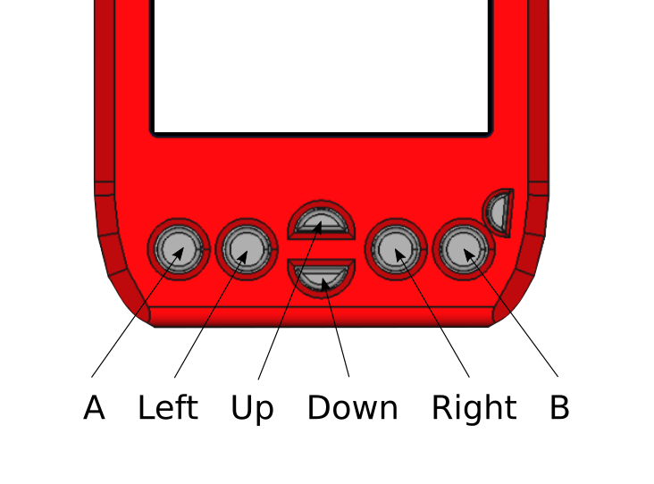

### SDA OS HW functions
#### Constants
##### Indicator LED
| Constant | Description |
|   ---    |    ---      |
| LED_ON | Nonification led on |
| LED_OFF | Nonification led off |
| LED_BLINK | Nonification led pattern |
| LED_SHORTBLINK | Nonification led pattern |
| LED_ALARM | Nonification led pattern |
##### Buttons
| Constant | Description |
|   ---    |    ---      |
| BTN_A | Button define |
| BTN_LEFT | Button define |
| BTN_UP | Button define |
| BTN_DOWN | Button define |
| BTN_RIGHT | Button define |
| BTN_B | Button define |
 
##### Expansion pin states
| Constant | Description |
|   ---    |    ---      |
| PIN_IN | Expansion pin setup define |
| PIN_OUT | Expansion pin setup define |
| PIN_ALT | Expansion pin setup define |
| PIN_NOPULL | Expansion pin setup define |
| PIN_PULLUP | Expansion pin setup define |
| PIN_PULLDOWN | Expansion pin setup define |

#### LCD Functions
##### Lock LCD sleep
    sys.hw.lockSleep([num]val);
Sets sleep lock value. On 1 system wont go to sleep.
Return: None
##### Turn on the LCD
    sys.hw.wakeLcd();
Turns on the LCD screen.
Return: None
##### Get LCD state
    sys.hw.getLcdState();
Gets state of lcd.
Return: 1 if lcd is on, otherwise 0
##### Get USB State
    sys.hw.getUsbState();
Gets state of usb port. Useful for determining if the SDA is connected to PC.
Return: 1 when powered from usb, otherwise 0
##### Set notification led pattern
    sys.hw.setLed([num]led_type);
Sets notification led to a given pattern, uses:
LED_ON, LED_OFF ,LED_BLINK, LED_SHORTBLINK, LED_ALARM
Return: None
#### Expansion Ports
##### Define direction of pins on the internal expansion
    sys.iPinDef([num]Pin, [num]type, [num]pullUp);
Sets direction of internal expansion pins.
Uses defines: PIN_IN, PIN_OUT, PIN_ALT, PIN_NOPULL, PIN_PULLUP, PIN_PULDOWN
Pin number is number of pin on the connector, can be read from schematics.
Return: None
##### Set state of pins on the internal expansion
    sys.iPinSet([num]Pin, [num]val);
Sets state of internal expansion pin.
Value 1 sets the pin high, value 0 sets it low.
Pin number is number of pin on the connector, can be read from schematics.
Return: None
##### Get state of pins on the internal expansion
    sys.iPinGet([num]Pin, [num]val);
Gets state of internal expansion pin.
Pin number is number of pin on the connector, can be read from schematics.
Return: 1 if the pin is high, 0 if it is low.
##### Define direction of pins on the expansion
    sys.ePinDef([num]Pin, [num]type, [num]pullUp);
Sets direction of external expansion pins.
Uses defines: PIN_IN, PIN_OUT, PIN_ALT, PIN_NOPULL, PIN_PULLUP, PIN_PULDOWN
Pin number is number of pin on the connector, can be read from schematics.
Return: None
##### Set state of pins on the expansion
    sys.ePinSet([num]Pin, [num]val);
Sets state of external expansion pin.
Value 1 sets the pin high, value 0 sets it low.
Pin number is number of pin on the connector, can be read from schematics.
Return: None
##### Get state of pins on the expansion
    sys.ePinGet([num]Pin, [num]val);
Gets state of external expansion pin.
Pin number is number of pin on the connector, can be read from schematics.
Return: 1 if the pin is high, 0 if it is low.
##### Get ADC readout
    sys.eADCRead();
Gets state of external expansion pin.
Pin number is number of pin on the connector, can be read from schematics.
Return: [float] measured voltage in volts.
#### Buttons
##### Get button event
    sys.hw.btn.getEvent([num] btn)
Return last button event
Return: 0 - none, 1-pressed, 2 - hold, 3 - released
##### Clears button events
    sys.hw.btn.clrEvent([num]btn)
Sets button event to EV_NONE
Return: None
##### Enable button events with LCD off
    sys.hw.btn.stdbyEn([num]val)
Enables button readout with LCD off
Return: None
### Communication
#### Serial transmit queue
Could be used for all the transmission modes.
##### Serial expansion transmit queue
    sys.com.qAdd([num]data);
Queues given hex value to transmit buffer.
Max 32 bytes.
Return: [num] 1-ok, 0-full buffer
##### Serial expansion transmit queue clear
    sys.com.qClr();
Clears transmit buffer.
Return: None
#### USB serial interface

##### USB serial transmit
    sys.com.usbTrs([str]data);
Sends given string to usb serial port.
Return: None
##### USB serial transmit queue
    sys.com.usbTrsQ();
Sends previously stored queue to the initialized serial port.
Queue can be filled with sys.srlTrsQAdd and cleared with sys.srlTrsQClr.
Max 32 bytes.
Return: None
##### USB serial receive
    sys.com.usbRcv([num]timeout);
Gets string (max 512 bytes) from USB serial port.
If nothing is sent during timeout (in ms), empty string is returned.
Return: [str] data
##### USB serial receive init
    sys.com.usbRcvIT();
Initializes usb serial port receive operation in non-blocking mode
Returns 1 if ok, 0 if error occurred
Return: [num] result
##### USB serial get ready flag
    sys.com.usbGetRd();
Gets transmission ready flag. Returns 1 if data is pending,
2 if whole line of data is pending
Return: [num] ready
##### USB serial get pending data
    sys.com.usbGetStr();
Gets the pending string and resets the serial interface
for another ready flag.
Return: [str] pending
##### USB serial get pending data
    sys.com.usbGetBytes();
Gets the bytes from a serial interface and stores them in local buffer (512 Bytes max)
Return: [num] bytes used
##### USB serial get pending data
    sys.com.usbGetByte([num] index);
Reads the byte value from a serial interface local buffer (512 Bytes)
Return: [num] byte value (0 - 255, -1 when error occurs)
#### Expansion port serial interface

##### Serial expansion transmit
Code to init the internal expansion port serial interface:
    sys.hw.iPinDef(15, PIN_ALT, PIN_NOPULL);
    sys.hw.iPinDef(16, PIN_OUT, PIN_NOPULL);
Code to init the external expansion port serial interface:
    sys.hw.ePinDef(5, PIN_ALT, PIN_NOPULL);
    sys.hw.ePinDef(6, PIN_ALT, PIN_NOPULL);
##### Serial expansion transmit
    sys.com.uartTrs([str]data);
Sends given string to serial port on internal or external expansion connector.
Depends on what is initialized.
Return: None
##### Serial expansion transmit queue
    sys.com.uartTrsQ();
Sends previously stored queue to the initialized serial port.
Max 32 bytes.
Return: None
##### Serial expansion recieve
    sys.com.uartRcv([num]timeout);
Gets string (max 512 bytes) from currently initialized serial port.
If nothing is sent during timeout (in ms), empty string is returned.
Return: [str] data
#### Serial recieve in non-blocking mode
For more flexible serial interface operations
##### Serial expansion receive
    sys.com.uartRcvIT();
Initializes serial port receive operation in non-blocking mode
Returns 1 if ok, 0 if error occurred
Return: [num] result
##### Serial expansion get ready flag
    sys.com.uartGetRd();
Gets transmission ready flag. Returns 1 if data is pending,
2 if whole line of data is pending
Return: [num] ready
##### Serial expansion get pending data
    sys.com.uartGetStr();
Gets the pending string and resets the serial interface
for another ready flag.
Return: [str] pending
##### Serial expansion get pending data
    sys.com.uartGetBytes();
Gets the bytes from a serial interface and stores them in local buffer (512 Bytes)
Return: [num] bytes used
##### Serial expansion get pending data
    sys.com.uartGetByte([num] index);
Gets the byte value from a serial interface local buffer (512 Bytes)
Return: [num] byte value (0 - 255, -1 when error occurs)
